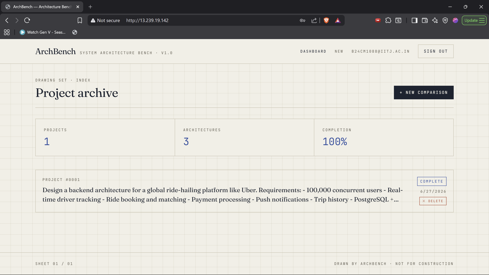
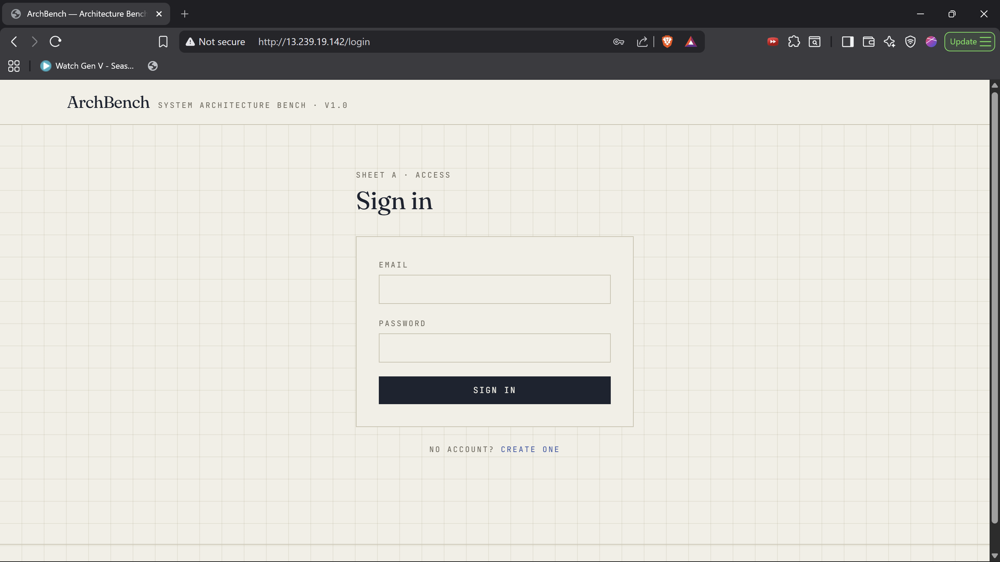
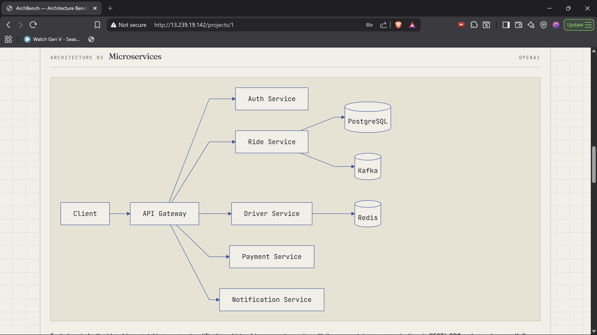
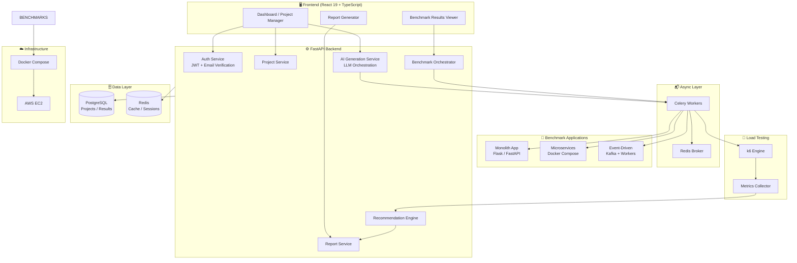
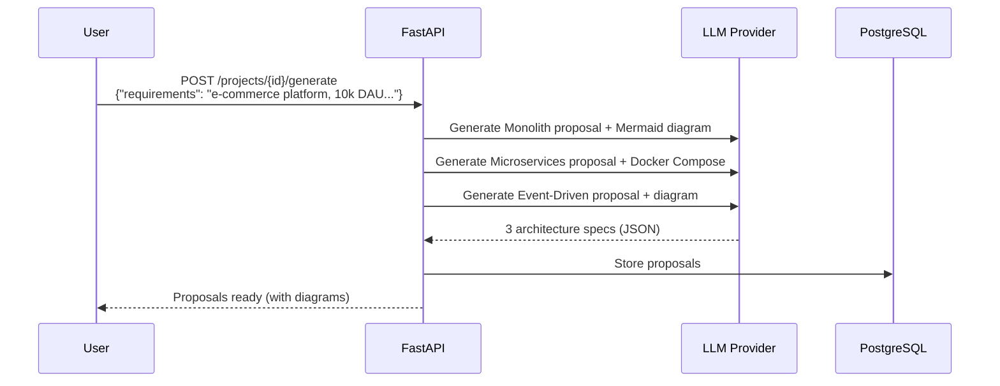
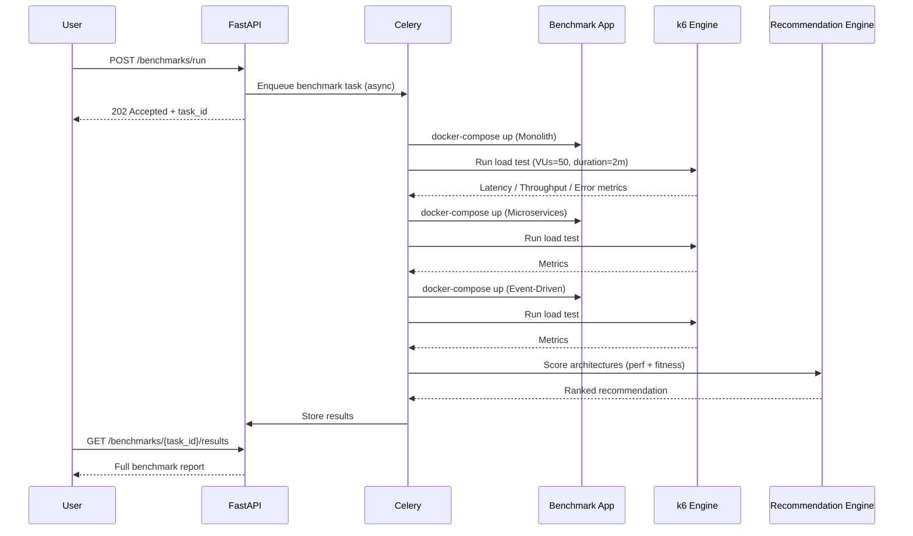
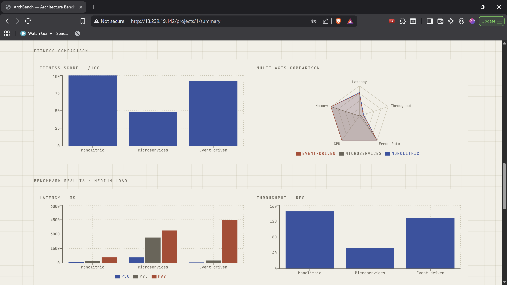
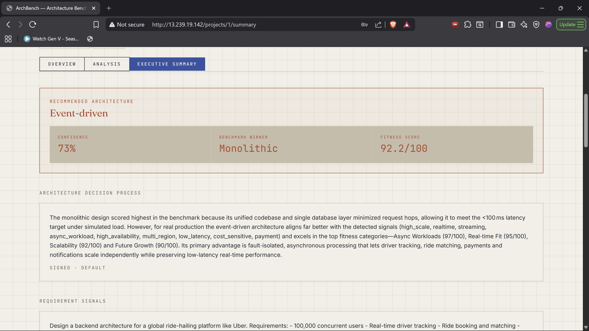

<div align="center">

# ⚡ ArchBench

### AI Architecture Decision Intelligence Engine

[](https://fastapi.tiangolo.com)
[](https://react.dev)
[](https://postgresql.org)
[](https://redis.io)
[](https://docker.com)
[](https://aws.amazon.com)


**Stop guessing your architecture. Start benchmarking it.**

ArchBench takes your natural language requirements, generates three production-grade architecture proposals, deploys real benchmark applications, runs live load tests with k6, and produces a data-driven Architecture Decision Report — all in one platform.

[**Live Demo**](#) · [**Documentation**](#) · [**Report a Bug**](issues) · [**Request a Feature**](issues)

---
<p align="center">
  
</p>

</div>

---

## 🤔 Why ArchBench?

Every engineering team faces the same question: **Monolith, Microservices, or Event-Driven?**

The answer depends on your specific load profile, team size, budget, and scalability needs — but most tools give you opinions, not data. ArchBench gives you **real numbers from real benchmarks** on your specific requirements.

| Traditional Approach | ArchBench Approach |
|---|---|
| Architecture discussions based on gut feeling | AI-generated proposals grounded in your requirements |
| Theoretical comparisons from blog posts | Real k6 load tests on deployed benchmark apps |
| Manual cost estimates | Automated cloud cost projections |
| Decision made before any data exists | Decision backed by latency, throughput, and resilience data |

---

## ✨ Key Features

- 🤖 **AI Architecture Generation** — LLM-powered generation of Monolithic, Microservices, and Event-Driven proposals from natural language input
- 📊 **Real Benchmarking** — Not simulations. Actual benchmark applications are deployed and tested with k6
- 🔄 **Async Benchmark Execution** — Celery-powered task queue for non-blocking, background benchmark runs
- 📈 **Comprehensive Metrics** — Latency (p50/p95/p99), throughput (RPS), error rate, CPU, and memory usage
- 🛡️ **Resilience Testing** — Fault injection, chaos testing, and recovery time measurement
- 🔍 **Bottleneck Detection** — Automated identification of performance constraints across architectures
- 💰 **Cloud Cost Estimation** — AWS cost projections based on measured resource consumption
- 📐 **Capacity Planning** — Scalability curves and future traffic projections
- 🏋️ **Architecture Fitness Engine** — Scores each architecture against your requirement vectors
- 🧠 **Hybrid Recommendation Engine** — Combines benchmark performance + requirement fitness for a final recommendation
- 📄 **Decision Reports** — Production-ready Architecture Decision Reports in Markdown and PDF
- 🔐 **JWT Authentication** — Secure user auth with email verification

<p align="center">
  
</p>


- 🐳 **Dockerized Deployment** — One-command setup for local and production environments
- ☁️ **AWS EC2 Ready** — Pre-configured for cloud deployment

---

## 🏗️ System Architecture

<p align="center">
  
</p>



---

## 🛠️ Tech Stack

| Layer | Technology | Purpose |
|---|---|---|
| **Frontend** | React 19, TypeScript, Tailwind CSS | UI, state management, type safety |
| **Backend** | FastAPI, Python 3.11+ | REST API, async request handling |
| **Task Queue** | Celery + Redis | Async benchmark execution |
| **Database** | PostgreSQL 16 | Projects, results, users |
| **Cache** | Redis 7 | Session cache, Celery broker |
| **Load Testing** | k6 | Real HTTP load generation |
| **AI/LLM** | Claude, OpenAI, OpenRouter | Architecture generation |
| **Containerization** | Docker, Docker Compose | Benchmark apps + deployment |
| **Infra** | AWS EC2, Nginx | Production hosting |
| **Auth** | JWT + Email Verification | Secure authentication |
| **Diagrams** | Mermaid.js | Architecture visualization |

---

## 🔄 How It Works

### 1. AI Architecture Generation Workflow



### 2. Real Benchmark Workflow



### 📊 Live Benchmark Dashboard

<p align="center">
  
</p>


### 3. Recommendation Engine

The hybrid recommendation engine combines two signal sources with configurable weights:

```
Final Score = (α × Benchmark Performance Score) + (β × Requirement Fitness Score)
```

**Benchmark Performance Score** is derived from:
- Normalized p99 latency (lower is better)
- Requests per second throughput (higher is better)
- Error rate under load (lower is better)
- CPU and memory efficiency

**Requirement Fitness Score** is derived from an architecture fitness engine that parses your requirements and scores each architecture against vectors including:
- Team size and operational complexity
- Expected traffic patterns
- Consistency vs. availability tradeoffs
- Deployment complexity tolerance
- Budget constraints

The engine then applies bottleneck detection, resilience scores from fault injection tests, and cloud cost projections to produce a ranked final recommendation with supporting rationale.


## 📈 Analytics Dashboard

Visualize latency, throughput, CPU usage, memory consumption, and recommendation scores.

<p align="center">
  
</p>
---

## 📁 Folder Structure

```
archbench/
├── backend/
│   ├── app/
│   │   ├── api/
│   │   │   └── v1/
│   │   │       ├── auth.py          # JWT auth, email verification
│   │   │       ├── projects.py      # Project CRUD
│   │   │       ├── generation.py    # AI architecture generation
│   │   │       ├── benchmarks.py    # Benchmark orchestration
│   │   │       ├── reports.py       # Report generation
│   │   │       └── recommendations.py
│   │   ├── core/
│   │   │   ├── config.py            # Settings (pydantic-settings)
│   │   │   ├── security.py          # JWT logic
│   │   │   └── celery_app.py        # Celery configuration
│   │   ├── models/                  # SQLAlchemy ORM models
│   │   ├── schemas/                 # Pydantic request/response schemas
│   │   ├── services/
│   │   │   ├── llm/
│   │   │   │   ├── strategy.py      # Strategy pattern for LLM providers
│   │   │   │   ├── claude.py
│   │   │   │   ├── openai.py
│   │   │   │   └── openrouter.py
│   │   │   ├── benchmark/
│   │   │   │   ├── orchestrator.py  # Docker Compose management
│   │   │   │   ├── k6_runner.py     # k6 load test execution
│   │   │   │   └── metrics.py       # Metrics collection & parsing
│   │   │   ├── recommendation/
│   │   │   │   ├── engine.py        # Hybrid recommendation logic
│   │   │   │   ├── fitness.py       # Requirement fitness scoring
│   │   │   │   └── bottleneck.py    # Bottleneck detection
│   │   │   └── report/
│   │   │       ├── generator.py     # Markdown/PDF report builder
│   │   │       └── templates/
│   │   └── tasks/
│   │       └── benchmark_tasks.py   # Celery async tasks
│   ├── benchmark_apps/
│   │   ├── monolith/                # Benchmark monolith app
│   │   ├── microservices/           # Benchmark microservices setup
│   │   └── event_driven/            # Benchmark event-driven app
│   ├── k6_scripts/
│   │   └── load_test.js             # k6 load test scripts
│   ├── alembic/                     # DB migrations
│   ├── tests/
│   └── Dockerfile
├── frontend/
│   ├── src/
│   │   ├── components/
│   │   │   ├── Dashboard/
│   │   │   ├── BenchmarkResults/
│   │   │   ├── ArchitectureDiagram/
│   │   │   └── ReportViewer/
│   │   ├── pages/
│   │   ├── hooks/
│   │   ├── api/                     # Axios API client + JWT interceptors
│   │   └── types/
│   └── Dockerfile
├── nginx/
│   └── nginx.conf
├── docker-compose.yml               # Full stack orchestration
├── docker-compose.prod.yml          # Production overrides
└── .env.example
```

---

## 🚀 Getting Started

### Prerequisites

- Docker & Docker Compose
- Node.js 20+ (for local frontend dev)
- Python 3.11+ (for local backend dev)
- k6 installed ([install guide](https://k6.io/docs/get-started/installation/))

### Environment Variables

Copy `.env.example` to `.env` and fill in the values:

```env
# Database
POSTGRES_DB=archbench
POSTGRES_USER=archbench_user
POSTGRES_PASSWORD=your_secure_password
DATABASE_URL=postgresql://archbench_user:your_secure_password@db:5432/archbench

# Redis
REDIS_URL=redis://redis:6379/0

# JWT
SECRET_KEY=your_super_secret_key_min_32_chars
ACCESS_TOKEN_EXPIRE_MINUTES=30

# Email (for verification)
SMTP_HOST=smtp.gmail.com
SMTP_PORT=587
SMTP_USER=your@email.com
SMTP_PASSWORD=your_app_password

# LLM Providers (add whichever you use)
ANTHROPIC_API_KEY=sk-ant-...
OPENAI_API_KEY=sk-...
OPENROUTER_API_KEY=sk-or-...
DEFAULT_LLM_PROVIDER=claude   # claude | openai | openrouter

# Frontend
VITE_API_BASE_URL=http://localhost:8000
```

---

## 🐳 Running with Docker (Recommended)

```bash
# Clone the repository
git clone https://github.com/yourusername/archbench.git
cd archbench

# Set up environment
cp .env.example .env
# Edit .env with your values

# Start all services
docker compose up --build

# Run database migrations
docker compose exec backend alembic upgrade head
```

The platform will be available at:
- **Frontend:** http://localhost:3000
- **Backend API:** http://localhost:8000
- **API Docs:** http://localhost:8000/docs

---

## 💻 Running Locally (Development)

**Backend:**
```bash
cd backend
python -m venv venv
source venv/bin/activate  # Windows: venv\Scripts\activate
pip install -r requirements.txt

# Start FastAPI
uvicorn app.main:app --reload --port 8000

# In a separate terminal, start Celery worker
celery -A app.core.celery_app worker --loglevel=info
```

**Frontend:**
```bash
cd frontend
npm install
npm run dev
```

---

## ☁️ Production Deployment (AWS EC2)

```bash
# On your EC2 instance (Ubuntu 22.04 recommended)
sudo apt update && sudo apt install -y docker.io docker-compose-plugin nginx

# Clone and configure
git clone https://github.com/yourusername/archbench.git
cd archbench
cp .env.example .env
# Edit .env for production (use strong secrets, real SMTP, etc.)

# Start with production compose file
docker compose -f docker-compose.prod.yml up -d

# Set up Nginx reverse proxy
sudo cp nginx/nginx.conf /etc/nginx/sites-available/archbench
sudo ln -s /etc/nginx/sites-available/archbench /etc/nginx/sites-enabled/
sudo nginx -t && sudo systemctl reload nginx
```

> 💡 **Tip:** Use an Elastic IP on your EC2 instance and point your domain to it for a stable URL.

---

## 📡 API Overview

| Method | Endpoint | Description |
|---|---|---|
| `POST` | `/api/v1/auth/register` | Register with email verification |
| `POST` | `/api/v1/auth/login` | Login, receive JWT |
| `GET` | `/api/v1/projects` | List user projects |
| `POST` | `/api/v1/projects` | Create project with requirements |
| `POST` | `/api/v1/projects/{id}/generate` | Trigger AI architecture generation |
| `GET` | `/api/v1/projects/{id}/architectures` | Fetch generated architectures + diagrams |
| `POST` | `/api/v1/benchmarks/run` | Start async benchmark run |
| `GET` | `/api/v1/benchmarks/{task_id}/status` | Poll benchmark task status |
| `GET` | `/api/v1/benchmarks/{task_id}/results` | Fetch full benchmark results |
| `GET` | `/api/v1/recommendations/{project_id}` | Get hybrid recommendation |
| `POST` | `/api/v1/reports/{project_id}/generate` | Generate Decision Report (MD/PDF) |

Full interactive docs available at `/docs` (Swagger UI) and `/redoc`.

---

## 📊 Example Output

### Benchmark Results (sample)

```
Architecture        | p50 Latency | p99 Latency | RPS     | Error Rate | CPU Avg
--------------------|-------------|-------------|---------|------------|--------
Monolith            | 12ms        | 45ms        | 1,240   | 0.1%       | 38%
Microservices       | 28ms        | 120ms       | 890     | 0.8%       | 52%
Event-Driven        | 8ms         | 35ms        | 1,580   | 0.2%       | 41%
```

### Recommendation Engine Output (sample)

```json
{
  "recommended": "event_driven",
  "confidence": 0.87,
  "scores": {
    "monolith":      { "benchmark": 0.74, "fitness": 0.61, "final": 0.68 },
    "microservices": { "benchmark": 0.58, "fitness": 0.72, "final": 0.65 },
    "event_driven":  { "benchmark": 0.89, "fitness": 0.85, "final": 0.87 }
  },
  "rationale": "Event-Driven architecture achieves the lowest p99 latency and highest throughput under the specified load profile. Given the async-heavy workload pattern in your requirements, the decoupled producer-consumer model aligns well with your scalability goals.",
  "bottlenecks_detected": ["microservices: inter-service network overhead at >500 RPS"],
  "estimated_monthly_cost_usd": {
    "monolith": 142,
    "microservices": 387,
    "event_driven": 218
  }
}
```

---

## 🔮 Future Improvements

- [ ] **Kubernetes support** — Generate Helm charts alongside Docker Compose configs
- [ ] **More LLM providers** — Gemini, Mistral, local Ollama
- [ ] **Custom benchmark scripts** — Let users define their own k6 scenarios
- [ ] **Historical trend analysis** — Track how architectures evolve over requirement changes
- [ ] **Team collaboration** — Multi-user projects with shared reports
- [ ] **CI/CD integration** — GitHub Actions webhook to trigger re-benchmarking on requirement changes
- [ ] **Serverless architecture type** — Add Lambda/Cloud Functions as a 4th architecture option
- [ ] **Real-time benchmark streaming** — WebSocket updates during live benchmark runs

---

## 🤝 Contributing

Contributions are welcome!

```bash
# Fork the repo, then:
git checkout -b feature/your-feature-name
# Make your changes
git commit -m "feat: add your feature"
git push origin feature/your-feature-name
# Open a Pull Request
```

Please follow conventional commits and ensure all tests pass (`pytest` for backend, `npm test` for frontend).

---

<div align="center">

Built by [Pratyaksh Tyagi](https://github.com/Pratyaksh-13) · IIT Jodhpur

⭐ If ArchBench helped you make a better architecture decision, consider giving it a star!

</div>
